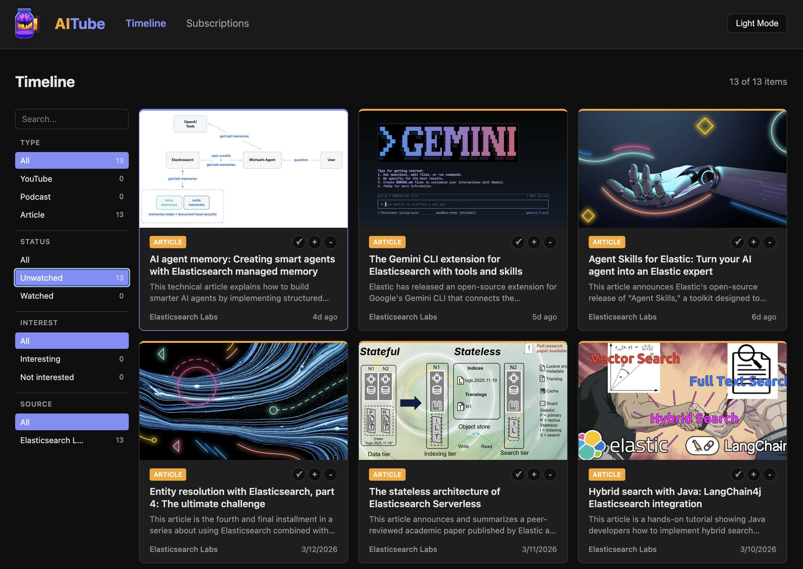

# AITube



Personal feed reader for YouTube, podcasts, and RSS with AI-powered curation. One unified timeline, no algorithms.

## Stack

- **Backend:** Python 3.12 / FastAPI
- **Frontend:** React 19 / Vite / TypeScript
- **Data:** Elasticsearch
- **Ingestion:** [content-dlp](https://github.com/derickson/content-dlp) HTTP service + yt-dlp for YouTube captions
- **AI:** Claude Sonnet for summaries, ad detection, interest scoring, and content chat

## Setup

### Quick Start (recommended)

Requires [uv](https://docs.astral.sh/uv/) and Node.js 22+.

```bash
# Install all dependencies (frontend + backend)
make init

# Copy and configure environment variables
cp .env.example .env
# Edit .env with your Elasticsearch and Anthropic API keys

# Start dev servers with hot reload (backend :3103, frontend :8103)
make dev

# Stop servers
make stop
```

### Manual Setup

#### Backend

```bash
# Install dependencies (venv lives at ~/.venvs/aitube)
uv sync

# Run the dev server
uv run uvicorn backend.app.main:app --host 0.0.0.0 --port 3103 --reload
```

The API starts at `http://localhost:3103`. Health check: `GET /health`.

#### Frontend

```bash
cd frontend
npm install
npm run dev
```

The dev server starts at `http://localhost:8103/aitube/` and proxies API requests to the backend.

### Docker

```bash
docker compose up --build
```

- Backend: `http://localhost:3103`
- Frontend: `http://localhost:8103/aitube/`

### Reverse Proxy

The frontend is hosted under the `/aitube/` path, making it easy to serve alongside other apps behind a reverse proxy. Point your reverse proxy at `http://host:8103/aitube/` for the UI and `http://host:3103/api/` for the backend API.

### Cron

Poll feeds automatically every 30 minutes (adjust paths for your environment):

```
*/30 * * * * cd /path/to/aitube && uv run python -m backend.scripts.poll_feeds >> /path/to/aitube/cron.log 2>&1
```

Or poll manually:

```bash
uv run python -m backend.scripts.poll_feeds
```

## Configuration

Set in `.env`:

| Variable | Default | Description |
|----------|---------|-------------|
| `ELASTICSEARCH_URL` | `http://localhost:9200` | Elasticsearch endpoint |
| `ELASTICSEARCH_API_KEY` | | Elasticsearch API key |
| `ANTHROPIC_API_KEY` | | Claude API key for summaries and ad detection |
| `CONTENT_DLP_URL` | `http://localhost:7055` | content-dlp HTTP service URL |
| `YOUTUBE_MAX_AGE_DAYS` | `5` | Only poll YouTube videos newer than this |
| `PODCAST_MAX_AGE_DAYS` | `5` | Only poll podcast episodes newer than this |
| `RSS_MAX_AGE_DAYS` | `90` | Only poll RSS articles newer than this |
| `ELASTIC_APM_SERVER_URL` | | Elastic APM server URL (enables backend observability) |
| `ELASTIC_APM_API_KEY` | | APM agent API key (for Elastic Cloud Serverless) |
| `ELASTIC_APM_SECRET_TOKEN` | | APM secret token (for self-managed APM Server) |
| `ELASTIC_APM_ENVIRONMENT` | `development` | APM environment label |
| `VITE_ELASTIC_APM_SERVER_URL` | | APM server URL for frontend RUM (build-time) |
| `VITE_ELASTIC_APM_ENVIRONMENT` | `development` | APM environment for frontend RUM (build-time) |

### Observability (Elastic APM)

Optional. Set `ELASTIC_APM_SERVER_URL` to enable backend tracing (services: `aitube-backend`, `aitube-poller`). Set `VITE_ELASTIC_APM_SERVER_URL` to enable frontend Real User Monitoring (service: `aitube-frontend`).

**Auth:** Use `ELASTIC_APM_API_KEY` for Elastic Cloud Serverless (create via Kibana `POST kbn:/api/apm/agent_keys`), or `ELASTIC_APM_SECRET_TOKEN` for self-managed APM Server. If both are set, API key takes precedence. Frontend RUM requires no secret — the public APM URL is sufficient.

**Note:** Frontend APM vars (`VITE_*`) are baked in at Docker build time. Rebuild the frontend container after changing them.

## Adding Subscriptions

Paste any URL into the subscription manager — the system auto-detects the type and resolves metadata:

- **YouTube:** channel URLs (`youtube.com/@handle`) or video URLs
- **Podcasts:** direct RSS feeds, Apple Podcasts links, or Spotify links
- **RSS/Atom:** direct feed URLs or any website (auto-discovers `<link rel="alternate">` feeds, probes common feed paths relative to the URL and domain root)

The resolver fetches the feed name, thumbnail, description, and sample items for preview before subscribing. A warning is shown if no feed is discovered. YouTube Shorts are automatically filtered out.

## Content Pipeline

When new content is discovered during polling:

1. **YouTube videos:** captions fetched via yt-dlp (instant, no download). Falls back to content-dlp transcription if captions unavailable. Videos that fail transcript fetch (e.g., rate limits) are automatically retried on subsequent poll cycles.
2. **Podcast episodes:** audio downloaded and transcribed locally via content-dlp. Claude detects ads in the first 90 seconds and sets the playback position to skip past them.
3. **RSS articles:** full page scraped to markdown via content-dlp webscrape.
4. **All types:** Claude generates a summary with a bullet-point breakdown of key topics. Videos and podcasts include clickable timestamps that seek the player. Duplicate content items are automatically detected and removed after each poll cycle.


## Features

- **Unified timeline** with faceted search (type, watched/unwatched, interest, source) powered by Elasticsearch
- **Flyout content viewer** with embedded YouTube player, HTML5 audio player, and distraction-free article reader
- **Content chat** — ask questions about any content item with streaming AI responses; configurable agents with clickable timestamp citations for video/podcast seek
- **Timestamped transcripts** with live playback highlighting and click-to-seek
- **Playback tracking** with resume from last position and 90% auto-complete
- **Interest voting** (up/down) per content item to mark what's interesting
- **AI summaries** with bullet-point breakdowns and clickable timestamp links for video/podcast seek
- **Ad skip** for podcasts — Claude detects sponsor reads and sets playback past them
- **Smart URL resolution** for YouTube channels, Apple Podcasts, Spotify, and RSS discovery
- **Light/dark theme** toggle
- **Subscription management** with per-feed interest notes, type-colored cards, search, and filters

## Project Structure

```
backend/
  app/
    main.py              # FastAPI entry point
    config.py            # Settings from .env
    routers/
      subscriptions.py   # CRUD + URL resolution
      content.py         # Search, facets, CSV export, interest, consumed
      playback.py        # Position tracking
      polling.py         # Feed poll triggers
      chat.py            # Streaming content Q&A with agents
    services/
      elasticsearch.py   # ES client, index mappings, lifecycle
      content_dlp.py     # HTTP client for content-dlp service on host
      feed_poller.py     # Poll subscriptions, transcribe, summarize
      url_resolver.py    # Smart URL resolution
      youtube_captions.py # yt-dlp caption fetching
      ad_detector.py     # Claude-powered podcast ad detection
      summarizer.py      # Claude-powered content summaries
      content_cleanup.py # Two-stage article cleanup (regex + LLM)
      agents.py          # Agent registry for content chat
    models/              # Pydantic schemas
  scripts/
    poll_feeds.py        # Crontab entry point
frontend/
  public/
    images/              # Pixel art assets (logo, empty states)
  src/
    components/
      Timeline.tsx           # Content grid with facet sidebar
      ContentView.tsx        # Flyout player/reader with transcript
      ContentTabs.tsx        # Tab switcher for content view panels
      ChatPanel.tsx          # Streaming chat for content Q&A
      SubscriptionManager.tsx # Subscription CRUD with URL resolver
      ErrorBanner.tsx        # Error display with clipboard copy
    api/client.ts        # Typed backend API client
    theme/               # Light/dark theme
```

## API Endpoints

All API paths use trailing slashes. This is required for compatibility with reverse proxies that add trailing slashes via rewrite rules.

| Method | Path | Description |
|--------|------|-------------|
| GET | `/health/` | Health check |
| POST | `/api/subscriptions/resolve/` | Auto-detect feed type and metadata from any URL |
| POST | `/api/subscriptions/` | Add a subscription |
| GET | `/api/subscriptions/` | List subscriptions (with content counts) |
| GET | `/api/subscriptions/{id}/` | Get subscription |
| PATCH | `/api/subscriptions/{id}/` | Update subscription |
| DELETE | `/api/subscriptions/{id}/` | Delete subscription |
| GET | `/api/content/` | Search content with facets (type, consumed, interest) |
| GET | `/api/content/export/csv/` | Export all content as CSV |
| GET | `/api/content/{id}/` | Get content item |
| PUT | `/api/content/{id}/consumed/` | Set consumed status |
| PUT | `/api/content/{id}/interest/` | Set interest (up/down/none) |
| POST | `/api/content/{id}/transcribe/` | Trigger transcription for a content item |
| DELETE | `/api/content/{id}/` | Delete content item |
| DELETE | `/api/content/by-external-id/{external_id}/` | Delete content item by external_id |
| POST | `/api/content/playback-progress/` | Batch get playback progress |
| GET | `/api/playback/{id}/` | Get playback position |
| PUT | `/api/playback/{id}/` | Update playback position |
| POST | `/api/polling/trigger/` | Trigger feed poll (all active subscriptions) |
| POST | `/api/polling/trigger/{id}/` | Trigger feed poll (single subscription) |
| GET | `/api/chat/agents/` | List available chat agents |
| POST | `/api/chat/{item_id}/stream/` | Stream chat response for a content item |
| GET | `/api/watchlist/` | Unwatched YouTube videos |
| POST | `/api/submit_video/` | Submit YouTube URLs for background processing |

## Automation API

The watchlist endpoints are designed for external tools and scripts that want to interact with AITube programmatically.

### Get unwatched YouTube videos

Returns all YouTube videos that haven't been marked as watched, sorted by publish date (newest first).

```bash
curl http://localhost:3103/api/watchlist/
```

Supports pagination via `size` (default 50, max 200) and `offset` query parameters:

```bash
curl "http://localhost:3103/api/watchlist/?size=10&offset=0"
```

Response is a JSON array of content items:

```json
[
  {
    "id": "abc123",
    "title": "Video Title",
    "url": "https://www.youtube.com/watch?v=...",
    "type": "video",
    "consumed": false,
    "published_at": "2026-03-30T12:00:00Z",
    "duration_seconds": 612,
    "subscription_id": "sub_id_or_adhoc",
    ...
  }
]
```

The response excludes `summary`, `transcript`, and `content_markdown` to keep payloads lightweight. Use `GET /api/content/{id}/` to fetch the full item.

### Submit ad-hoc YouTube videos

Send an array of YouTube URLs for AITube to fetch, transcribe, and summarize in the background. These don't need to belong to any subscription. The endpoint returns immediately — processing happens asynchronously.

```bash
curl -X POST http://localhost:3103/api/submit_video/ \
  -H "Content-Type: application/json" \
  -d '{"urls": ["https://www.youtube.com/watch?v=dQw4w9WgXcQ"]}'
```

Response:

```json
{
  "accepted": ["https://www.youtube.com/watch?v=dQw4w9WgXcQ"],
  "skipped": [],
  "errors": []
}
```

- **accepted** — URLs that will be processed in the background
- **skipped** — URLs for videos already in the system (deduped by video ID)
- **errors** — URLs that couldn't be parsed as valid YouTube links

Accepted URL formats: `youtube.com/watch?v=`, `youtu.be/`, `youtube.com/embed/`, `youtube.com/shorts/`

Processing per video takes 1-3 minutes (caption fetch + AI summarization). Once complete, the video appears in the watchlist and content search. Ad-hoc videos are stored with `subscription_id: "adhoc"`.
